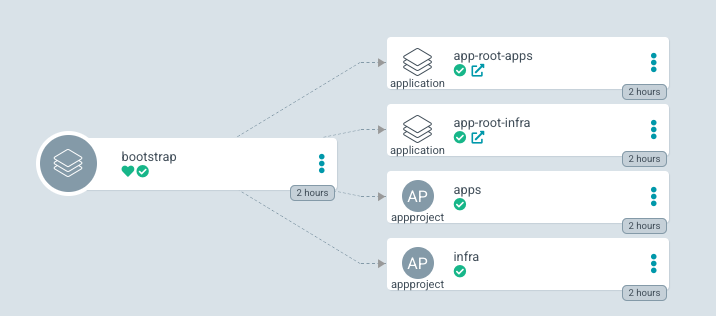
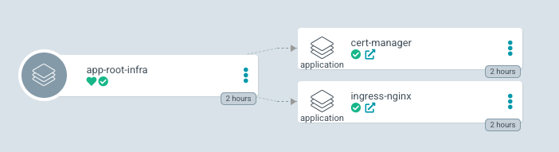

# ArgoCD-example

Sample configuration repository for ArgoCD thats install the following:

- ingress-nginx
- cert-manager
- demo application

## Prerequisites

- a Kubernetes Cluster
- ArgoCD & ArgoCD cli installed
- ArgoCD bootstrap:

```bash
# create ArgoCD Namespace
kubectl create namespace argocd
# install ArgoCD
kubectl apply -n argocd -f https://raw.githubusercontent.com/argoproj/argo-cd/stable/manifests/install.yaml
# Create ArgocD boostrap application
argocd app create bootstrap --repo https://github.com/whiteducksoftware/argocd-example.git --path argocd-config --dest-server https://kubernetes.default.svc --dest-namespace argocd
```

## App of Apps pattern

This demo repository make use of the [ArgoCD - App Of Apps Pattern](https://argo-cd.readthedocs.io/en/stable/operator-manual/cluster-bootstrapping/#app-of-apps-pattern) that declaratively specify one Argo CD app that consists only of other apps.

- Root applications



- Applications



## Repository structure

This Git repository contains the following top directories:

- `argocd-config` dir contains a Helm chart thats creates ArgoCD root projects & applications
- `gitops-apps` dir contains a Helm chart thats creates ArgoCD applications
- `helm-charts` dir contains Helm charts

```bash
./
├── argocd-config
└── gitops-apps
│   ├── apps
│   ├── infra
└── helm-charts
    ├── apps
    └── infra
```

### argocd-config

The `argocd-config` dir contains a Helm Chart that defines ArgoCD root projects & applications:

```yaml
---
apiVersion: argoproj.io/v1alpha1
kind: AppProject
metadata:
  name: infra
  namespace: argocd
spec:
  clusterResourceWhitelist:
    - group: '*'
      kind: '*'
  destinations:
    - namespace: '*'
      server: "https://kubernetes.default.svc"
  orphanedResources:
    warn: false
  sourceRepos:
    - "https://github.com/whiteducksoftware/argocd-example.git"
---
apiVersion: argoproj.io/v1alpha1
kind: Application
metadata:
  name: app-root-infra
  namespace: argocd
spec:
  project: infra
  source:
    repoURL: "https://github.com/whiteducksoftware/argocd-example.git"
    targetRevision: HEAD
    path: "gitops-apps/infra"
  destination:
    namespace: default
    server: https://kubernetes.default.svc
  syncPolicy:
    automated:
      prune: true
      selfHeal: true
      allowEmpty: true
```

### gitops-apps

The `gitops-app` dir contains a Helm Chart that defines ArgoCD applications:

```yml
---
apiVersion: argoproj.io/v1alpha1
kind: Application
metadata:
  name: ingress-nginx
  namespace: argocd
  finalizers:
    - resources-finalizer.argocd.argoproj.io
spec:
  project: apps
  source:
    repoURL: "https://github.com/whiteducksoftware/argocd-example.git"
    targetRevision: HEAD
    path: "helm-charts/apps/ingress-nginx"
  destination:
    namespace: ingress-nginx
    server: https://kubernetes.default.svc
  syncPolicy:
    automated:
      prune: true       # Specifies if resources should be pruned during auto-syncing ( false by default ).
      selfHeal: true    # Specifies if partial app sync should be executed when resources are changed only in target Kubernetes cluster and no git change detected ( false by default ). When disabled and resources are changed only in kubernetes, resources will be marked out of sync. If set, this will automatically heal all child-applications, even when they are temporarily marked as non-self-healing.
      allowEmpty: true  # Allows deleting all application resources during automatic syncing ( false by default ).
    syncOptions:
      - Validate=true                      # Disables resource validation (equivalent to 'kubectl apply --validate=false'). Default: true
      - ApplyOutOfSyncOnly=true            # If the sync option is set Argo CD will sync only out-of-sync resources. Default: false
      - PrunePropagationPolicy=foreground  # Supported policies are background, foreground and orphan. Default: foreground
      - PruneLast=false                    # Allow the ability for resource pruning to happen as a final, implicit wave of a sync operation. Default: false
      - Replace=false                      # If the sync option is set the Argo CD will use kubectl replace or kubectl create command to apply changes. Default: false
      - CreateNamespace=true               # Namespace Auto-Creation ensures that namespace specified as the application destination exists in the destination cluster. Default: false
    retry:
      limit: 5           # number of failed sync attempt retries; unlimited number of attempts if less than 0
      backoff:
        duration: 5s     # the amount to back off. Default unit is seconds, but could also be a duration (e.g. "2m", "1h")
        factor: 2        # a factor to multiply the base duration after each failed retry
        maxDuration: 3m  # the maximum amount of time allowed for the backoff strategy
```

### helm-charts

The `helm-charts` dir contains Helm charts
